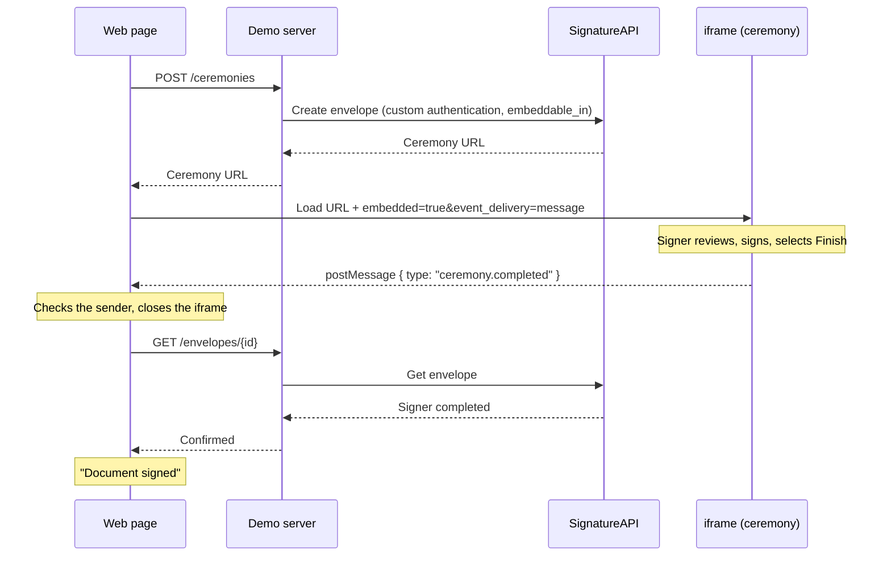

# SignatureAPI web embedding demo

Embedded e-signing in a web page with [SignatureAPI](https://signatureapi.com).

Select a button, and the page creates a sample envelope, opens the signing ceremony in an `<iframe>`, and shows how it ended.

| Part | Stack |
|---|---|
| [Page](web/) | Plain HTML, CSS and JavaScript. No build step. |
| [Demo server](server/) | TypeScript on Node.js, Express |

The page talks to a small [demo server](server/) that holds the SignatureAPI key, creates envelopes, and serves the page. The key never reaches the browser.

<a href="docs/media/web-signing.mp4"></a>

The recording is a real run in Chromium against SignatureAPI test mode. Select it for the full-quality video.

**New to embedding in a web page?** Read [Embedding SignatureAPI in a web page](docs/embedding-in-a-web-page.md). It covers the pattern, the events, who may frame the ceremony, cookies and storage, link lifetime and testing, and the ceremony behavior it describes is checked by this repo's tests.

Embedding in a native app instead? See the [mobile integration demo](https://github.com/signatureapi/signatureapi-mobile-integration-demo).

## How it works



The page treats `ceremony.completed` as a UI signal and shows "Document signed" only after the server confirms the envelope. A real integration would use a webhook for this.

## Quick start

You need a SignatureAPI account. Everything here runs in **test mode**: envelopes are not legally binding, and no emails are sent.

Requires Node.js 22.18 or later.

```bash
cd server
npm install
npx --yes signatureapi init   # opens a browser to approve; writes a test key to .env without printing it
npm run dev
```

Or copy `.env.example` to `.env` and paste a test key (`key_test_…`) from the [dashboard](https://dashboard.signatureapi.com/settings/api-keys). The server refuses to start with a live key.

Open <http://localhost:3000>, select **Sign document**, sign, and select **Finish**.

Use `localhost`, not `127.0.0.1`. The ceremony may be framed only by the origin the server names in `embeddable_in`, and the two are different origins. Set `PORT` in `.env` if port 3000 is taken.

### Loading a ceremony you created yourself

Paste a ceremony URL into **Ceremony URL**, or pass it in the address: `http://localhost:3000/?url=<ceremony url>`. The page adds `embedded=true` and `event_delivery=message` if they are missing. The ceremony's `embeddable_in` must include the page's origin, here `http://localhost:3000`.

## Hosted page

The page alone is published at <https://signatureapi.github.io/ceremony-embed-demo/>. There is no demo server behind it, so **Sign document** is hidden and the page offers only the **Ceremony URL** field. Create the ceremony yourself with `https://signatureapi.github.io` in its `embeddable_in`, and paste its URL. The result screen then shows what the ceremony reported, with nothing confirmed on a server.

Only the page is deployed. The demo server has no authentication: anyone who can reach it can create envelopes with your key and get signing links. It listens on `localhost` only, and it is not meant to be deployed.

## Tests

The tests run real ceremonies against SignatureAPI test mode. Nothing is mocked.

| Suite | What it proves | Run |
|---|---|---|
| [Server](server/) | Envelope creation, framing rules (CSP `frame-ancestors`), resuming and replacing links, input validation, no ceremony URL in logs | `cd server && npm test` |
| [Browser](e2e/) | The page end to end in Chromium, WebKit and Firefox: signing, canceling, errors, forged messages, refused framing, cookies and storage, and the page without its server | `cd e2e && npm test` |

## Repository layout

```
index.html Redirect to web/, for the hosted page's address
web/       The page: host HTML, the message listener, styles and fonts
server/    Demo backend (TypeScript, Express): creates envelopes, returns ceremony URLs, serves the page
e2e/       Browser tests (Playwright): the page and the ceremony in three engines
docs/      Embedding guide and the demo recording
```

## License

[MIT](LICENSE). The fonts in [`web/fonts`](web/fonts) are under the SIL Open Font License 1.1; see [web/README.md](web/README.md).
